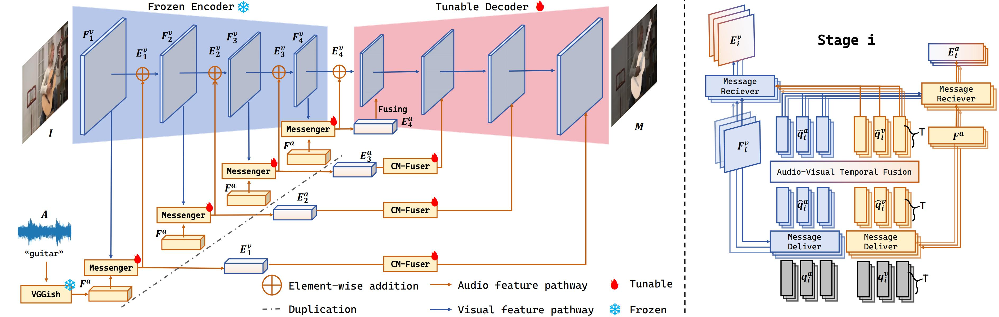

# A Simple Baseline for Parameter Efficient Audio-Visual Segmentation

This repository is the official implementation of A Simple Baseline for Parameter Efficient Audio-Visual Segmentation. 

>📋  **Method Overview.** Left: Our framework includes frozen visual and audio encoders, Messenger Blocks, and a lightweight decoder. The Messenger Blocks, placed between different stages of the visual encoder, facilitates bidirectional feature interaction.**Right:** Messenger Block contains three components: 1) audio and visual features are compressed into a small set of messenger queries via the Message Deliver (MD) operation; 2) audio-visual temporal fusion (AVTF) captures cross-modal temporal dependencies among the queries; 3) the Message Receive (MR) operation projects the temporal-level information back to the raw features to enable feature adaptation.

<p align="center">
  

</p>

******

## Requirements

## 1. Environments

```setup
pip install torch==1.10.0+cu111 torchvision==0.11.0+cu111 torchaudio==0.10.0 -f https://download.pytorch.org/whl/torch_stable.html
pip install mmcv-full -f https://download.openmmlab.com/mmcv/dist/cu111/torch1.10.0/index.html
pip install pandas
pip install timm
pip install resampy
pip install soundfile
```

## 2. Datasets
> Please refer to the link [AVSBenchmark](https://github.com/OpenNLPLab/AVSBench) to download the datasets. You can put the data under data folder or rename your own folder. Remember to modify the path in config files. The data directory is as bellow:


```
|--data
   |--AVSS
   |--Multi-sources
   |--Single-source
```

## 3. Training

To train the model(s) in the paper, run this command:

```train
TASK = "s4"  # or ms3, avss
CONFIG = "config/s4/ETAVS_pvt2_s4.py"

bash train.sh ${TASK} ${CONFIG}
```

## 4. Evaluation

To evaluate my model on AVSBench-Object/AVSBench-Semantic, run:

```eval
TASK = "s4"  # or ms3, avss
CONFIG = "config/s4/ETAVS_pvt2_s4.py"
CHECKPOINT = "work_dir/ETAVS_pvt2_s4/S4_best.pth"

bash test.sh ${TASK} ${CONFIG} ${CHECKPOINT}
```


## 5. Citation


```
@article{zhou2023avss,
      title={Audio-Visual Segmentation with Semantics}, 
      author={Zhou, Jinxing and Shen, Xuyang and Wang, Jianyuan and Zhang, Jiayi and Sun, Weixuan and Zhang, Jing and Birchfield, Stan and Guo, Dan and Kong, Lingpeng and Wang, Meng and Zhong, Yiran},
      journal={arXiv preprint arXiv:2301.13190},
      year={2023},
}
```